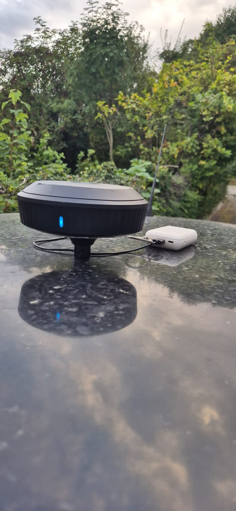
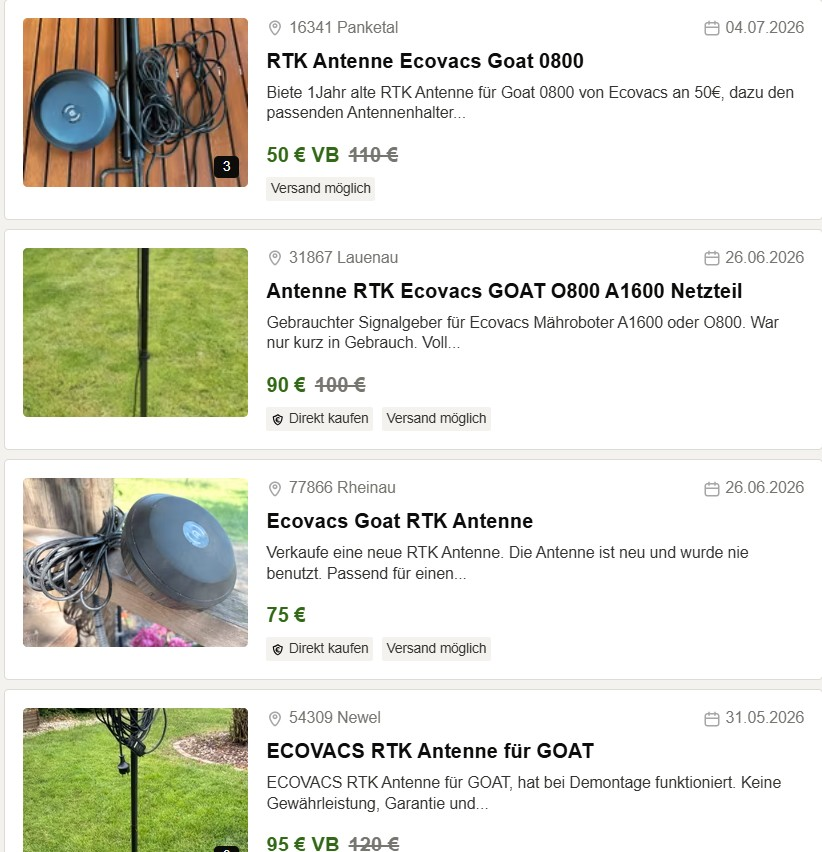
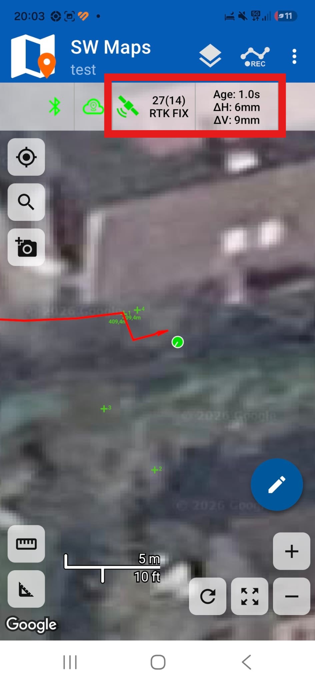
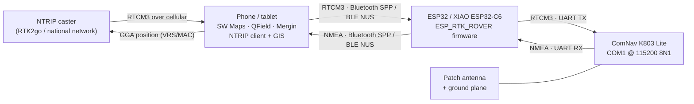
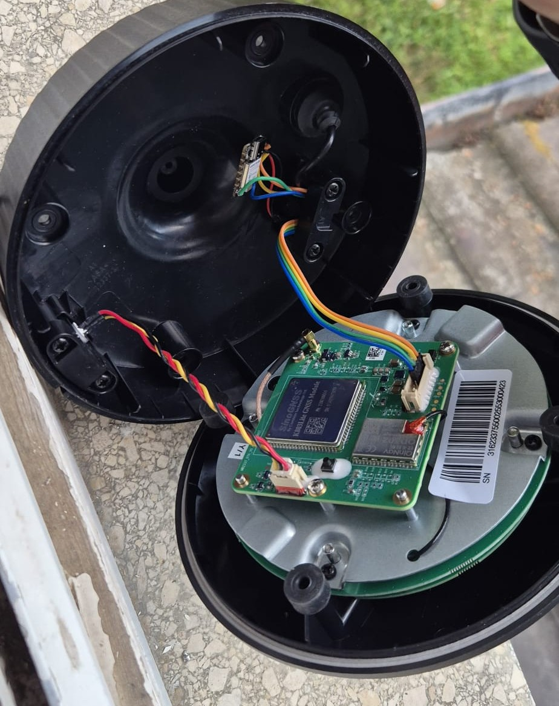
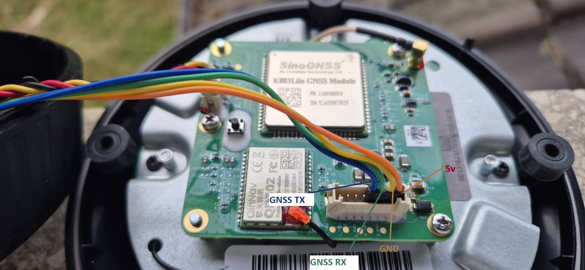
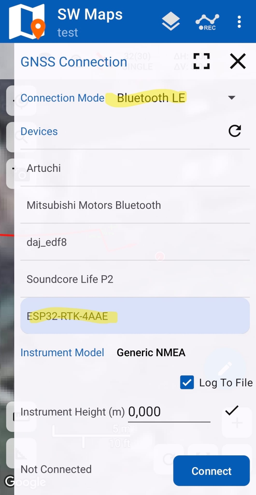

# ESP_RTK_ROVER

**Turn a 50 € e-waste ECOVACS GOAT RTK base station into a centimetre-accurate GNSS rover.**

[](https://www.espressif.com/)
[](https://platformio.org/)
[](https://www.comnavtech.com/)
[](#results)
[](#results)
[](#license)
[](#license)
[](#contributing)

<p align="center">
  
</p>

<p align="center">
  <b><a href="https://hmd83.github.io/ESP_RTK_ROVER/install/">⚡ Flash in your browser</a></b> ·
  <b><a href="https://hmd83.github.io/ESP_RTK_ROVER/web/rtk-monitor.html">🛰️ Live Dashboard</a></b> ·
  <a href="HARDWARE.md">🔧 Hardware &amp; Wiring</a> ·
  <a href="COMMANDS.md">📡 K803 Commands</a> ·
  <a href="FLASHING.md">📖 Flashing Guide</a>
</p>

---

## What this is

The ECOVACS GOAT robotic lawnmower ships with an external **RTK base station** — the black
dome you screw onto a pole in the garden. Owners sell them off constantly (broken mower,
upgraded model, moved house), so they turn up on the German second-hand market for **40–95 €**.

Inside that dome is a **SinoGNSS K803 Lite** by ComNav Technology: a multi-constellation,
multi-frequency GNSS OEM board with a real survey-grade RTK engine, paired with a decent
patch antenna and a machined ground plane. The same silicon in a commercial rover housing
sells for well north of 3 000 €.

This project throws away the proprietary radio link, wires the K803's **COM1** to an ESP32,
and turns the whole thing into a **Bluetooth RTK rover** that any mobile GIS app can talk to.

<p align="center">
  <br>
  <sub>Typical second-hand listings — this is the entire hardware cost of the project.</sub>
</p>

### What the firmware does

- **Configures the K803 on every boot** — the factory unit comes up as a *base station*. The
  ESP32 replays a ComNav/NovAtel ASCII command sequence over COM1 that unlogs the factory
  messages, clears the stored base coordinate, switches the engine to **rover** mode, enables
  the NMEA sentences a GIS app expects, and finally drops the port into RTCM auto-detect.
  No laptop, no Windows tool, no Python script before a survey.
- **Bridges bytes, transparently** — NMEA up to the phone, RTCM3 corrections down to the
  receiver. It never parses, reframes or line-buffers the stream, so binary RTCM3 and UBX
  survive intact.
- **Speaks the Bluetooth dialect your app expects** — Bluetooth Classic **SPP** on the ESP32,
  **BLE (Nordic UART Service)** on the XIAO ESP32-C6.
- **Ships a diagnostic dashboard** — a single self-contained HTML page that connects straight
  to the rover over Web Bluetooth and decodes the live NMEA: fix quality, σ-values, DOPs,
  correction age, raw sentence log.

### What it is not

- There is **no NTRIP client on the ESP32**. Corrections come from the phone, which already
  has the cellular connection and the caster credentials — see [Architecture](#architecture).
  On-board NTRIP over Wi-Fi is on the [roadmap](#roadmap).
- The dashboard is **not served by the ESP32**. It is an offline HTML file you open in Chrome
  or Edge; it talks to the rover over Web Bluetooth, not over HTTP.

---

## Results

Field-tested against a public NTRIP network with SW Maps on Android:

| Metric | Observed |
|---|---|
| Solution | **RTK FIXED** |
| Horizontal precision (ΔH) | **6 mm** |
| Vertical precision (ΔV) | **9 mm** |
| Correction age | 1.0 s |
| Satellites used / tracked | 14 / 27 |
| Time to fix (open sky, ~10 km baseline) | ~30–60 s from cold start |

<p align="center">
  
</p>

> Precision figures are the receiver's own σ estimates as reported to the app, not an
> independent check against a control point. Absolute accuracy also depends on your
> correction source, baseline length and antenna setup.

---

## Bill of materials

| Item | Notes | Typical cost |
|---|---|---|
| ECOVACS GOAT RTK base station | Any GOAT / O800 / A1600 / G1 "RTK Antenne" listing. Contains the K803 Lite, antenna and ground plane. | 40–95 € |
| **[Seeed Studio XIAO ESP32C6](https://www.seeedstudio.com/Seeed-Studio-XIAO-ESP32C6-p-5884.html)** *(primary build)* | BLE-only, thumbnail-sized, native USB-C, fits inside the dome. | ~8 € |
| — or — **ESP32 DevKitC (WROOM-32)** | Bluetooth Classic SPP for legacy collectors and Windows software. | ~6 € |
| USB power bank | 5 V, any capacity. Powers both boards for a full day of survey. | on hand |
| Silicone wire, JST leads, heat-shrink | 4 conductors: 5 V, GND, TX, RX. | on hand |
| Survey pole / tripod with 5/8″ thread | The dome already has the mount. | optional |

**Total: well under 100 €**, against 3 000 €+ for a comparable commercial rover.

---

## Architecture



The phone is the only device with an internet connection, so it runs the NTRIP client. It
also feeds your position back up to the caster as a GGA sentence, which is what network-RTK
(VRS / MAC / nearest-base) services need in order to generate a correction stream for your
location. The ESP32 sits in the middle and moves bytes.

**Boot sequence on the ESP32:**

1. UART comes up at 115 200 8N1 with a 4 KB RX buffer.
2. `gnssInit()` walks the K803 configuration sequence — about **13 seconds** (see
   [COMMANDS.md](COMMANDS.md)). This runs *before* Bluetooth starts, so a phone that
   connects early is never fed the command transcript.
3. The Bluetooth link starts advertising.
4. `loop()` pumps both directions and prints a throughput line every 5 s.

---

## Hardware variants

| Build env | Board | Transport | Use it when |
|---|---|---|---|
| `xiao_esp32c6_ble` | Seeed XIAO ESP32-C6 | **BLE** (Nordic UART) | **Primary build.** iOS *and* Android, modern GIS apps, fits inside the dome. |
| `esp32dev_spp` | ESP32 DevKitC | **Bluetooth Classic (SPP)** | Legacy data collectors, Windows GIS suites, anything that says "choose a paired Bluetooth device". Repo default. |
| `esp32dev_ble` | ESP32 DevKitC | BLE (Nordic UART) | Testing BLE on hardware you already own. |

### XIAO ESP32-C6 Edition — the compact one

Built around the
**[Seeed Studio XIAO ESP32C6](https://www.seeedstudio.com/Seeed-Studio-XIAO-ESP32C6-p-5884.html)**
([wiki](https://wiki.seeedstudio.com/xiao_esp32c6_getting_started/)) — a thumbnail-sized,
single-sided RISC-V board with native USB-C. It is the reason this rover fits *inside* the
original dome instead of hanging off it in a project box: the whole electronics addition is
21 × 17.5 mm. Cheap, well documented, and it just works with the pioarduino ESP32 platform.

Bluetooth Low Energy is what current mobile GIS software speaks, and it is the **only**
way to reach an iPhone: iOS gives no app access to Bluetooth Classic SPP without MFi
certification. The C6 has no Classic radio at all, which is fine — BLE is the target.

The firmware advertises as `ESP32-RTK-XXXX`, where `XXXX` is the last two octets of the
radio's MAC. Two rovers in the same field stay tellable apart in a scan list, and a phone's
bond for one is never reused for the other.

BLE tuning that matters for an RTK stream (all handled in firmware):

- MTU 247 → 244-byte notifications instead of 20
- Data-length extension 251
- Connection interval renegotiated to 7.5–15 ms (the 40 ms default bottlenecks the stream)
- Name in the advertisement, service UUID in the scan response — all three do not fit in
  31 bytes, and a nameless advertisement is hidden by phone Bluetooth menus

### Classic ESP32 Edition — the compatible one

Bluetooth Classic SPP is the profile an HC-05 or USB-TTL dongle presents. The phone pairs
with it from the normal system Bluetooth menu, and every GNSS app that offers "pick a paired
Bluetooth device" works — including a lot of software that never got a BLE mode.

> Note: `esp32dev_spp` builds with the `huge_app.csv` partition layout. Bluedroid with
> Classic enabled overflows the default 1.4 MB app partition. That layout has no OTA slot.

Full teardown, pinouts and wiring: **[HARDWARE.md](HARDWARE.md)**

---

## Quick start

### 1. Get the hardware out of the dome

Four screws, one harness. Full walkthrough with photos in **[HARDWARE.md](HARDWARE.md)**.

<p align="center">
  
</p>

### 2. Wire it

<p align="center">
  
</p>

| K803 harness | XIAO ESP32-C6 | ESP32 DevKitC |
|---|---|---|
| **GNSS TX** (blue) | `D7` / GPIO17 | GPIO16 (`RX2`) |
| **GNSS RX** (green) | `D6` / GPIO16 | GPIO17 (`TX2`) |
| **GND** (yellow) | `GND` | `GND` |
| **5 V** (orange) | `5V` (VBUS) — read the power notes | `VIN` / `5V` — read the power notes |

TX and RX **cross over**. If you get no data, swap those two first.

> ⚠️ **Never use GPIO1/GPIO3 (`TX0`/`RX0`) on the DevKitC.** They are wired to the onboard
> USB-serial chip; the receiver would fight the USB bridge and flashing would stop working.

> ⚠️ **Power is the number one cause of boot loops.** The K803 pulls 150–300 mA during
> acquisition. Details, symptoms and the fix are in [HARDWARE.md](HARDWARE.md#power).

### 3. Flash it

On a **XIAO ESP32C6** it is 1-click from Chrome or Edge — no toolchain, no Arduino IDE, no
drivers:

<p align="center">
  <a href="https://hmd83.github.io/ESP_RTK_ROVER/install/"><b>⚡ → Flash from your browser</b></a>
</p>

**ESP32 DevKitC users build from source** — deliberately. WROOM and WROVER need different
GNSS pins, SPP and BLE are different firmwares, and the SPP build needs its own partition
table; one published image would boot-loop on a good share of those boards.

```powershell
pio run -e xiao_esp32c6_ble -t upload   # XIAO ESP32-C6, BLE
pio run -e esp32dev_spp     -t upload   # ESP32 DevKitC, Bluetooth Classic
pio device monitor                      # console @ 115200
```

### 4. Connect your GIS app

<p align="center">
  
</p>

**SW Maps (Android / iOS)** — the reference setup:

1. **☰ → Bluetooth GNSS** to open **GNSS Connection**
2. **Connection Mode**: `Bluetooth LE` for the XIAO build, `Bluetooth` (Classic) for the
   DevKitC SPP build
3. **Devices** → pick `ESP32-RTK-XXXX` (here `ESP32-RTK-4AAE`).
   BLE builds show up in the app's own scanner; Classic builds must first be paired from the
   phone's system Bluetooth menu.
4. **Instrument Model**: `Generic NMEA`
5. **Instrument Height**: your pole height in metres, if you want SW Maps to reduce to the
   ground mark
6. **Connect**
7. **☰ → NTRIP Client** → caster host, port, mount point, user, password → **Connect**
8. Watch the status bar go `SINGLE` → `FLOAT` → **`RTK FIX`**

Verified apps:

| App | Platform | Transport |
|---|---|---|
| SW Maps | Android, iOS | BLE + Classic |
| QField | Android, iOS | BLE + Classic |
| Mergin Maps | Android, iOS | BLE + Classic |
| Mapit GIS | Android | BLE + Classic |
| Lefebure NTRIP Client | Android | Classic (SPP) |
| Windows GIS / serial collectors | Windows | Classic (SPP) over a virtual COM port |
| nRF Connect *(diagnostics)* | Android, iOS | BLE |

---

## Diagnostic dashboard

### ▶ [Open the live dashboard](https://hmd83.github.io/ESP_RTK_ROVER/web/rtk-monitor.html)

Hosted on GitHub Pages — nothing to install. Open it in **Chrome or Edge** (desktop or
Android), hit **Connect**, and pick the rover. It subscribes to the Nordic UART service and
decodes the stream live.

The page is `web/rtk-monitor.html`: one self-contained file, no build step, no server, no
dependencies, no telemetry. Your position never leaves the browser. Save it locally and it
works offline exactly the same.

| Panel | Shows |
|---|---|
| Fix banner | `RTK FIXED` / `RTK FLOAT` / `DGPS` / `SINGLE` / `NO FIX`, colour-coded; sats, HDOP, correction age, base ID, UTC |
| Position | Latitude/longitude to 8 decimals, DMS, one-click copy, "open in Maps" |
| GGA | MSL altitude, geoid separation, **derived ellipsoidal height**, sats used, HDOP, correction age, base ID |
| Quality & motion | σ latitude / σ longitude / σ altitude from GST, PDOP, VDOP, speed, course, date |
| Raw NMEA | Timestamped rolling log (400 lines), **checksum failures highlighted in red**, pause/clear |
| Footer | Bytes, sentence count, live B/s, bad-checksum counter, age of last fix |

Correction age is colour-graded (green < 5 s, amber 5–10 s, red > 10 s) because stale
corrections are the usual reason a fixed solution silently drops to float.

> Web Bluetooth is Chromium-only. Safari and Firefox do not implement it. The hosted link is
> served over `https://`, which is the secure context it needs; a local copy opened with
> `file://` works too.

> **Placeholder:** `media/dashboard.png` — screenshot of the dashboard with a live RTK fix.

---

## Configuration

`src/config.h`, with per-board overrides in `platformio.ini`:

| Setting | Default | Notes |
|---|---|---|
| `GNSS_BAUD` | `115200` | K803 COM1 rate |
| `GNSS_INIT_K803` | `1` | Set `0` for an already-configured receiver, or a non-ComNav one |
| `GNSS_CMD_PORT` | `"COM1"` | The **receiver's** port you wired to — not a PC COM port |
| `GNSS_CMD_WAIT_MS` | `600` | Settle time per command; the whole sequence is ~13 s |
| `LINK_DEVICE_NAME` | `ESP32-RTK` | BLE appends `-XXXX`; SPP uses it verbatim |
| `SPP_PIN` | *(off)* | Uncomment to force a legacy pairing PIN |
| `BLE_TX_POWER_DBM` | `9` | −12…+20; more range costs current |
| `BLE_ENABLE_BONDING` | `1` | "Just Works" pairing for apps that insist on a bond |
| `UPLINK_FLUSH_MS` | `12` | Max hold time for a partial packet |
| `UART_RX_BUF` | `4096` | Must absorb a radio stall without losing bytes |
| `DEBUG_USB` | `1` | Set `0` to silence the console |

Receiver-side configuration — every command, why it is there, and how to change output rates:
**[COMMANDS.md](COMMANDS.md)**

---

## Status LED

| Pattern | Meaning |
|---|---|
| Slow blink, ~600 ms | Waiting for a phone |
| Short blip every 2 s | Phone connected, link ready |

The DevKitC LED (GPIO2) is active-high; the XIAO's onboard LED is active-low and the build
sets `LED_ACTIVE_LOW=1` for it.

---

## Troubleshooting

The console prints a throughput line every 5 s — read it first:

```
[STAT] BLE linked  up 512 B/s (25600)  down 240 B/s (7200)
```

- `up > 0` → the receiver is talking **and** the phone link is alive
- `up = 0` while `linked` → the receiver side is wrong (wiring, baud, or init failed)
- `down > 0` → RTCM corrections are actually reaching the receiver

| Symptom | Cause | Fix |
|---|---|---|
| Phone never sees `ESP32-RTK` | Wrong build flashed | Boot log prints the active transport: `[SYS] … via SPP` / `via BLE` |
| Device appears in the app but not in the system Bluetooth menu | Normal for BLE | BLE peripherals are discovered by the app, not paired from the system menu |
| Paired, but no position | TX/RX swapped (most common), wrong baud, no common ground | Swap the data pair; check `GNSS_BAUD`; verify GND |
| Boot loop, `invalid header: 0xffffffff`, `TG0WDT_SYS_RESET` | **Power sag**, not firmware | Separate supply for the receiver, sharing only GND. [Details](HARDWARE.md#power) |
| Init log shows `REJECTED` lines | Port still in RTCM auto-detect, or a command your firmware build does not support | [COMMANDS.md → Recovery](COMMANDS.md#recovery-when-the-port-stops-answering) |
| `SINGLE` forever, never `FLOAT` | Corrections not arriving | Check `down` in `[STAT]`; check the app's NTRIP status; check mount point |
| `FLOAT`, never `FIXED` | Poor sky view, long baseline, multipath | Get clear sky, use the ground plane, shorten the baseline |
| Fix drops to `FLOAT` intermittently | Correction age climbing | Watch the dashboard's amber/red age; usually cellular dropouts |

A boot-loop bisection trick: connect **GND only**, then **VCC**, then the data lines, one at
a time. Whichever wire first triggers the loop names the culprit. If it loops with GND + VCC
and no data wires attached, it is definitively power.

---

## Repository layout

```
src/
  main.cpp        bidirectional pump, stats, status LED
  config.h        all tunables
  gnss_init.cpp   ComNav K803 rover configuration sequence
  link.h          transport interface (SPP and BLE implement it)
  link_spp.cpp    Bluetooth Classic SPP
  link_ble.cpp    BLE Nordic UART Service (NimBLE)
web/
  rtk-monitor.html  offline Web Bluetooth diagnostic dashboard
media/              teardown, wiring and field photos
platformio.ini      three build environments
```

`main.cpp` moves bytes and does not know which transport is in use.

---

## Roadmap

- [ ] On-board NTRIP client over Wi-Fi (rover works without a phone)
- [ ] Wi-Fi AP + captive-portal configuration (caster credentials, baud, device name)
- [ ] Dashboard served from the ESP32 itself
- [ ] Web Serial mode in the dashboard, for USB-connected diagnostics
- [ ] Configurable NMEA rate (5 Hz / 10 Hz) without a rebuild
- [ ] Raw observation logging to SD for post-processing (PPK / RINEX)
- [ ] 3D-printable ESP32 tray that clips inside the dome
- [ ] Pre-built release binaries + hosted ESP Web Tools installer page

---

## Contributing

Issues and pull requests are welcome — especially:

- Confirmation (or corrections) of the K803 command behaviour on other firmware builds
- Pinouts for other ECOVACS GOAT base-station board revisions
- App compatibility reports, good or bad

Please include your board revision, the boot log, and a `[STAT]` line when reporting a
hardware problem.

---

## Credits

**Hussein Daj** — hardware reverse engineering, teardown, K803 command discovery, field
testing and validation.

**Claude (Anthropic)** — project partner: firmware architecture, BLE/SPP transport layer,
diagnostic dashboard and documentation.

### Standing on

- **[Seeed Studio](https://www.seeedstudio.com/)** for the
  [XIAO ESP32C6](https://www.seeedstudio.com/Seeed-Studio-XIAO-ESP32C6-p-5884.html) — the
  board that makes the compact build possible, and a genuinely good piece of hardware
  documentation. 👋
- **[NimBLE-Arduino](https://github.com/h2zero/NimBLE-Arduino)** by h2zero — a BLE stack that
  fits and behaves.
- **[pioarduino](https://github.com/pioarduino/platform-espressif32)** — Arduino core 3.x for
  the C6.
- **[ESP Web Tools](https://github.com/esphome/esp-web-tools)** by ESPHome — browser flashing.
- Everyone who ever posted a GNSS teardown instead of keeping it to themselves.

---

## License

[MIT](LICENSE) — do what you like, credit appreciated, no warranty.

## Disclaimer

Not affiliated with, endorsed by, or supported by **ECOVACS**, **ComNav Technology** or
**SinoGNSS**. Opening the base station voids any remaining warranty and permanently ends its
usefulness to the mower it came with. Mains-free, low-voltage work only — but you are still
responsible for what you solder. Trademarks belong to their respective owners.

This is a hobbyist instrument. Do not use it for cadastral, legal, aviation, marine or
safety-of-life work.
